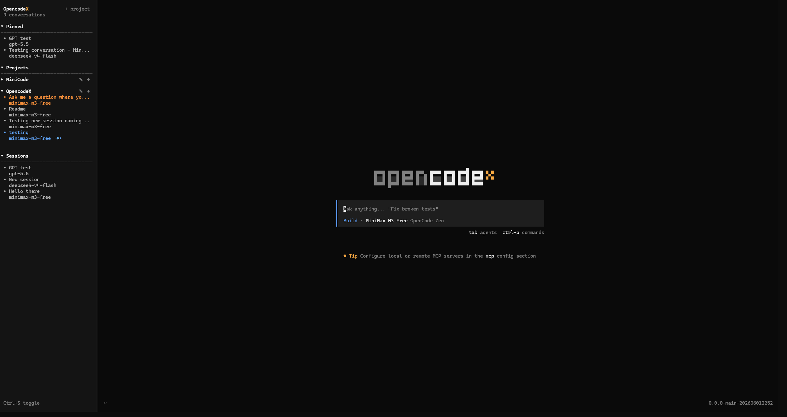

# OpencodeX

**A terminal-native fork of [opencode](https://github.com/anomalyco/opencode) built for people who run lots of AI coding sessions at once.**

OpencodeX turns the opencode TUI into a true multi-session workspace. Instead of one conversation in one terminal, you get a persistent sidebar, a project system for keeping separate codebases apart, concurrent agents with live status, and a dashboard that knows about every session you've ever started. No browser, no Electron, no separate desktop app — just one fast, keyboard-driven binary that lives in your terminal.

It's a drop-in replacement for the `opencode` CLI: same session format, same providers, same MCP servers, same plugins. Your existing history comes with you. You just get a much better cockpit to fly it from.

> Want to see it first? Skip to [Screenshots](#screenshots) or jump straight to [Install](#install).

## Why OpencodeX

If you use AI in your terminal every day, you've hit these problems:

- You have six conversations going at once and the one that needs your attention is buried three screens deep.
- You switch between a work repo, a side project, and a research scratchpad and their histories keep bleeding into each other.
- An agent finished a task while you were in another window and you didn't notice for an hour.
- A permission prompt is sitting in a session you can't see because the chat view is on something else.

OpencodeX is the answer to all of those, without giving up the TUI. It is built on top of the opencode TUI you already know, with a sidebar that always shows what every session is doing, projects that keep your codebases separate, and live status colors that tell you where to look first.

## What's new compared to upstream `opencode`

Everything in this list sits **on top of** the upstream TUI. You keep every feature opencode already had.

### A persistent conversation sidebar

Press `Ctrl+S` and a real sidebar appears on the left of the TUI. It stays there while you chat. Pinned sessions, project groups, and ungrouped sessions are all listed, with a live status dot on every row.

```
┌────────────────────────────────────────┐
│  OpencodeX                  + project  │
│  4 conversations                       │
│ ──────────────────────────────────────│
│  Pinned                                │
│  • Refactor auth layer                 │
│    claude-sonnet-4-5                   │
│  Projects                              │
│  ▾ manifold                            │
│    • Ship input-needed-color fix       │
│      ┊◇◆◇┊  claude-opus-4-5            │   <- in_progress (blue)
│    • Add workspace API                 │
│      gpt-5                             │
│  Sessions                              │
│  • New session - 2025-11-14            │
│  Ctrl+S toggle                         │
└────────────────────────────────────────┘
```

The dot to the left of each row tells you exactly what that session is doing:

- **Gray** — `dormant` (idle, no agent running)
- **Blue** — `in_progress` (an agent is producing output)
- **Orange** — `input_needed` (a permission or question is waiting for you)

The color is applied to both the title row and the model-name sub-row, so you can see at a glance which session needs attention — even when it is the one you're already looking at. When a session is running, an animated whip indicator next to the model name confirms it's actually doing work. Disable animations and the indicator collapses to a static glyph automatically.

### A multi-session dashboard

The dashboard is the first thing you see when you launch `opencodex`. It lists every conversation in the current project, grouped by recency and status, with a one-line preview of the last user message on each row. Press `o` from anywhere in the TUI to jump back to it. The dashboard and the sidebar share the same data source, so they stay in sync without manual refresh.

```
  OpencodeX dashboard
  ─────────────────────────────────────────────────────────────
  ▾ Today
    ● Refactor auth layer            claude-sonnet-4-5   2m ago
       "split the token validator into its own module"
    ● Ship input-needed-color fix    claude-opus-4-5     14m ago
       "make the orange dot work for permission prompts"
  ▸ Yesterday
  ▸ Last week
  ─────────────────────────────────────────────────────────────
   n new  enter resume  ctrl+s sidebar  q quit
```

For scripts and shell pipelines, the same dashboard is exposed as JSON:

```bash
opencodex dashboard --format json
```

### A project system

A project is a named group of folders that share a session pool. The intent is to keep separate codebases from mixing their history while still being able to attach a conversation to multiple folders at once. Each project also gets a home directory, so any new session in the project starts with the right working directory automatically.

- `+ project` in the sidebar header creates a new project.
- `✎` on a project row edits its name and folder list (semicolon- or newline-separated).
- `+` on a project row opens a fresh session bound to that project.
- A **Move Session** action in the Manage Sessions dialog rebinds a conversation to a different project.
- Deleting a project does **not** delete its sessions. They move into the unassigned list and stay resumable.

Projects are surfaced to the model too: when an agent is working inside a project, the active folder and the project's other configured folders are injected into its environment context, so the model always knows which workspaces it can touch.

### Concurrent agent instances

Multiple agent instances can be running at the same time. Each one has its own status row, its own status color, and its own whip animation. When a session blocks waiting for a permission grant or a user question, it flips to orange and a single press of `Enter` jumps you straight into its prompt so you can answer immediately. No more lost prompts.

### Resumable, importable history

OpencodeX reads the same on-disk session format as upstream `opencode`, so the same session id round-trips between the two CLIs. Switch back to upstream `opencode` and your history is still there. Switch back to OpencodeX and you pick up right where you left off. Sessions created before you ever installed OpencodeX are picked up automatically.

### A complete picker suite

Everything is keyboard-navigable. The TUI ships with:

- A **model picker** (any provider, any model)
- A **provider picker** (including your own custom providers)
- An **agent picker** (subagents, custom agents, MCP-loaded agents)
- An **MCP picker** (browse and toggle MCP servers on the fly)
- A **theme picker** (cycle with `Ctrl+L`, theme list includes the full upstream set)
- A **skill picker**
- A **command palette** (`Ctrl+P`) that is the authoritative source for every keybinding

### Plugin and SDK compatibility

The `opencode` plugin surface and the JavaScript SDK are preserved end-to-end. Community tools, plugins, and integrations you already use keep working. OpencodeX adds a small set of namespaced overlay routes under `/experimental/opencodex/*` for the new project system, but everything else is identical to upstream.

## Screenshots



The home screen on a fresh launch: the sidebar is open on the left, the prompt is empty and ready for a new session, and the sidebar gives you a live readout of every other conversation. In this capture:

- One session is **active** — blue dot, whip animation on the model row, the agent is producing output.
- One session is **awaiting feedback** — orange dot, it has a permission prompt or question waiting for you. A single `Enter` on that row jumps you straight into its prompt.
- The rest are **dormant** — gray dots, no resources being used, fully resumable with one keypress.

## Install

OpencodeX ships as a single binary. There is no installer, no daemon, and no system service — just a file in your `PATH`. Pick the path for your platform.

### macOS

The recommended path is to build from source with the bundled script.

```bash
git clone https://github.com/opencodex/opencodex.git
cd opencodex
bash build.sh --target darwin-arm64   # Apple Silicon
# or
bash build.sh --target darwin-x64     # Intel / Rosetta
sudo cp artifacts/opencodex-darwin-arm64 /usr/local/bin/opencodex
```

Then verify:

```bash
opencodex --version
```

### Linux

```bash
git clone https://github.com/opencodex/opencodex.git
cd opencodex
bash build.sh --target linux-x64
# or, for older CPUs without AVX2:
bash build.sh --target linux-x64-baseline
sudo cp artifacts/opencodex-linux-x64 /usr/local/bin/opencodex
```

Verify:

```bash
opencodex --version
```

### Windows

The Windows binary is cross-compiled from WSL so you do not have to leave Linux to build it. From a regular PowerShell window in the repo:

```powershell
pwsh -File .\build-and-install.ps1
```

That single command will build the Windows binary inside WSL and copy it to `%LOCALAPPDATA%\Programs\OpencodeX\opencodex.exe`, then add that directory to your user `PATH`. Restart your terminal, then verify:

```powershell
opencodex --version
```

If you already have a prebuilt artifact (for example, one shared by a teammate), you can skip the build step and install it directly:

```powershell
.\install-windows.ps1 -ArtifactPath .\artifacts\opencodex-windows-x64-baseline.zip
```

To uninstall later:

```powershell
.\install-windows.ps1 -Uninstall
```

### Build flags at a glance

`build.sh` accepts a few options you may want to know about:

| Flag | Effect |
| --- | --- |
| `--target <name>` | Build for a specific platform (defaults to `win32-x64-baseline`) |
| `--minify` | Enable minification (off by default to avoid Bun compile quirks) |
| `--clean` | Wipe the build cache in `/tmp` before starting |
| `--help` | Show the full list of supported targets |

Valid targets today: `win32-x64`, `win32-x64-baseline`, `win32-arm64`, `linux-x64`, `linux-x64-baseline`, `darwin-arm64`, `darwin-x64`.

## First run

Once `opencodex` is on your `PATH`, just run it:

```bash
opencodex
```

You will land in the dashboard. From there:

- `j` / `k` (or the arrow keys) move the selection up and down
- `Enter` resumes the selected session — or jumps to its prompt if it is blocked waiting for you
- `n` starts a brand-new session in the current project
- `Ctrl+S` toggles the sidebar
- `o` (or `Ctrl+U` from anywhere) jumps back to the dashboard
- `<leader>p` creates a new project
- `Ctrl+O` opens the Manage Sessions dialog
- `Ctrl+N` starts a new session bound to the current project
- `Ctrl+P` opens the command palette — the authoritative source for the full keymap
- `Ctrl+L` cycles themes
- `q` quits (with a confirmation if any session is still running)

The first time you run `opencodex`, you will be prompted to pick a provider and a model. After that, those choices are remembered, and you can change them any time from the pickers in the command palette.

## Using the project system

A typical first session with projects:

1. Launch `opencodex`.
2. Press `<leader>p` to create a project. Give it a name (for example, `work`) and one or more folder paths (semicolon- or newline-separated). These are the folders the model is allowed to read and edit when working in this project.
3. The project appears in the sidebar. Press `+` next to it, or `n` while it is selected, to start a session bound to that project. The session's working directory is set to the project root automatically.
4. Work as usual. When the model needs to look at a file, the configured folders are injected into its environment so it knows exactly what it can touch.
5. To reorganize later, open **Manage Sessions** with `Ctrl+O` and use **Move Session** to re-bind a conversation to a different project, or `✎` on the project row to edit its folder list.

Sessions that are not bound to a project still appear in the **Sessions** group in the sidebar and are fully resumable. Deleting a project moves its sessions back into the unassigned list — nothing is lost.

## Using concurrent agents

There is no special setup. Just start multiple sessions.

- A running session shows a blue dot in the sidebar and an animated whip next to its model name.
- A session that needs your input shows an orange dot. Press `Enter` on it to jump straight to its prompt.
- A dormant session shows a gray dot. It is not using any resources.

The dashboard groups them by recency, and the **Sessions** group in the sidebar lists every dormant one in the order it was last active, so picking up where you left off is a single keypress.

## Keybindings

The default keybindings:

| Key | Action |
| --- | --- |
| `Ctrl+S` | Toggle the sidebar |
| `Ctrl+U` | Go to the OpencodeX dashboard |
| `<leader>p` | Create a new project |
| `Ctrl+O` | Manage sessions (move, delete, rebind) |
| `Ctrl+N` | New session in the current project |
| `Ctrl+P` | Open the command palette |
| `Ctrl+L` | Cycle the theme |
| `Enter` | Resume the selected session (or jump to its prompt if blocked) |
| `n` | New session in the current project |
| `Esc` | Cancel the current input or dismiss a dialog |
| `Tab` / `Shift+Tab` | Cycle through the prompt, sidebar, and dashboard |
| `o` | Open the dashboard |
| `q` / `Ctrl+C` | Quit (with confirmation if any session is running) |

The full keymap, including every upstream opencode binding, is available from the command palette (`Ctrl+P`).

## Compatible with upstream `opencode`

OpencodeX is a strict superset of the upstream TUI. Anything you can do in upstream `opencode`, you can do in OpencodeX, plus the sidebar, the dashboard, the project system, and the new overlay API. Sessions, plugins, MCP servers, providers, themes, and the JavaScript SDK all work unchanged. You can keep both installed and switch between them with no migration.

## FAQ

**Does this replace the upstream `opencode` CLI?**
You can use either. Both binaries read and write the same session store, so you can move between them freely.

**Do I lose my history if I switch back to upstream `opencode`?**
No. The session format is the same. The same session id is recognized by both CLIs.

**Do my existing opencode plugins still work?**
Yes. The plugin surface and the JavaScript SDK are preserved end-to-end.

**Where does my data live?**
In the same on-disk location that upstream `opencode` uses, so existing backups and tools keep working.

**Can I run OpencodeX and upstream `opencode` at the same time?**
Yes, but you should avoid pointing both at the same session id simultaneously.

## Contributing

See [`CONTRIBUTING.md`](CONTRIBUTING.md) and [`AGENTS.md`](AGENTS.md) for development setup, style guide, and PR conventions. The default branch is `dev`; open PRs against it.

## License

MIT — same license as upstream `opencode`. See [`LICENSE`](LICENSE).
